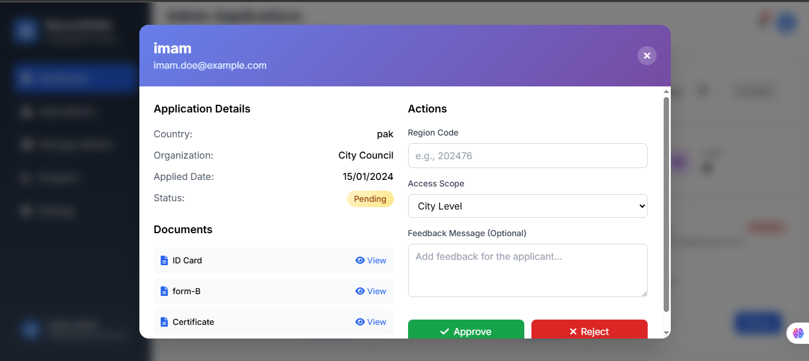

# Laravel Secure Voting API

A **robust, scalable, and highly secure Laravel-based Voting API** designed for real-world online voting systems.  
This project implements **multi-layer authentication**, **face verification**, **role-based access control**, and **token-secured voting** to ensure election integrity and voter authenticity.

---

## 🚀 Key Highlights

### 🔐 Multi-Layer Security
1. Email & password authentication  
2. Live face recognition for voter verification  
3. Token-based session validation for vote casting  

### 👥 Multi-Role Architecture
- **Super Admin** – Oversees elections, creates and manages Admins  
- **Admin** – Manages elections, voters, and candidates  
- **Candidate** – Submits and manages candidate profile  
- **Voter** – Authenticates securely and casts vote  

### 🧱 Scalable & Maintainable
- MVC architecture with strict separation of concerns  
- Clean, modular, and extensible codebase  

### 🔌 API-First Design
- Backend fully decoupled from frontend  
- Ready for web, mobile, or third-party integrations  

### 📧 Automated Verification
- Email verification using OTP  
- Secure credential delivery workflow  

---

## ✨ Features

### 🔑 Authentication & Authorization
- Token-based authentication using Laravel Sanctum  
- Role-based authorization (Super Admin, Admin, Candidate, Voter)  
- OTP-based email verification  
- Face recognition for live identity validation  

### 🗳️ Elections Management
- Super Admin manages Admin accounts and elections  
- Admin creates and supervises elections  
- Candidate participation and management  
- Secure voter validation before vote casting  

### 🛡️ Security & Validation
- Multi-layer authentication enforcement  
- Token validation required for voting  
- Role-protected API endpoints  
- Face verification prevents impersonation and duplicate voting  

---

## 🧩 System Architecture

- Laravel REST API backend  
- Token-based authentication (Sanctum)  
- Role-based middleware authorization  
- Decoupled frontend support  
- Designed for scalability and enterprise use  

---

## 📸 Project Screenshots

### Voter Registration (Face Verification)


### User Sign In


### Super Admin Dashboard (Election Commission)


### Creating New Admins


### Document Verification


### Managing Admins


### Admin Dashboard


### Voting Interface


### Candidate Display


---

## 🧪 Testing (Planned / In Progress)
- Authentication and authorization tests  
- Vote validation and token verification tests  

---

## 🔐 Security Considerations
- Role-based middleware protection  
- Secure password hashing  
- Token expiration and validation  
- Face verification ensures real voters only  

---

## 🛠️ Installation & Setup

```bash
# Clone the repository
git clone https://github.com/Enco-der/laravel-secure-voting-api.git
cd laravel-secure-voting-api

# Install backend dependencies
composer install

# Install frontend dependencies
npm install
npm run dev

# Environment setup
cp .env.example .env
php artisan key:generate

# Database migration
php artisan migrate

# Run the application
php artisan serve
