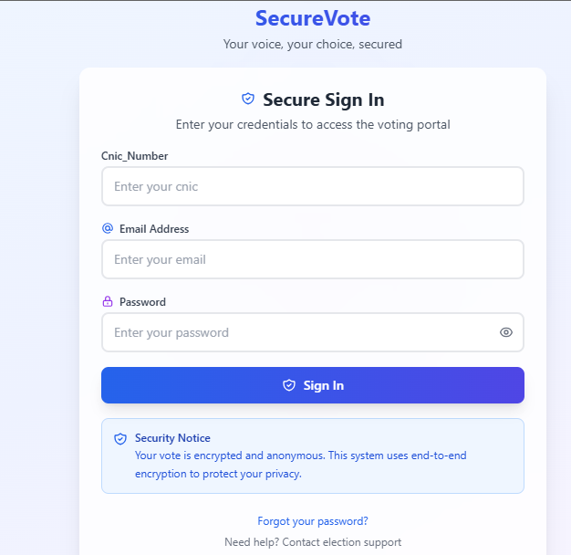
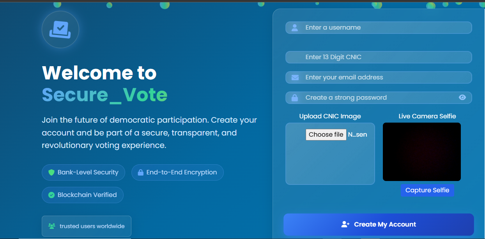
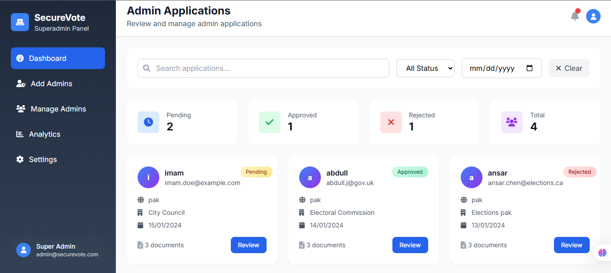
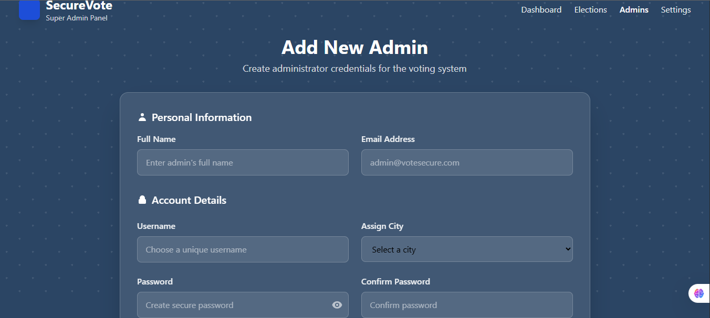
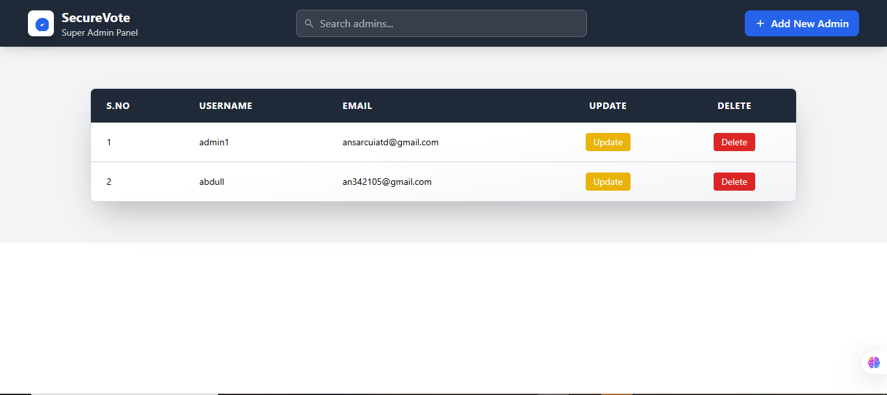
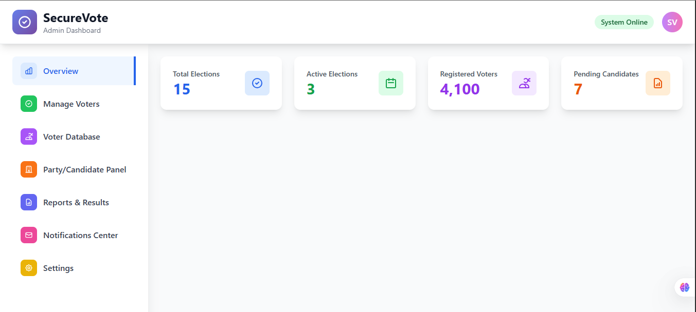
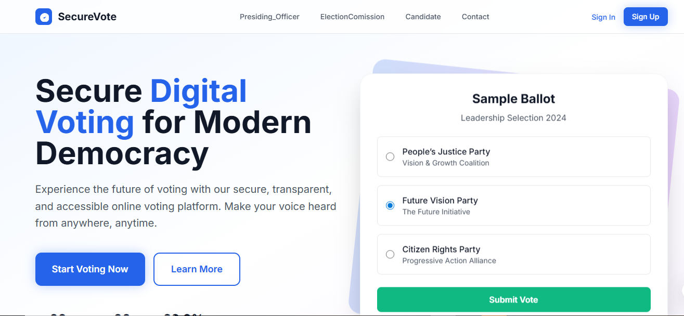
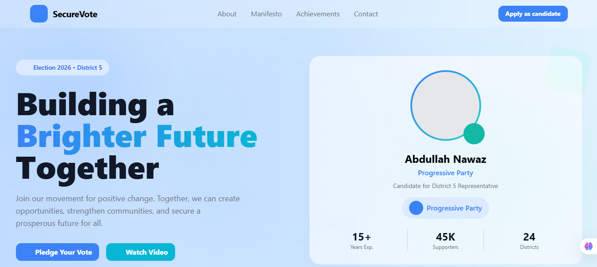

A robust, scalable, and highly secure **Laravel-based Voting API** with multi-layer authentication, face verification, role management, and token-based voting. Designed for real-world online voting applications.

------------------------------------------------------------------------------------------------------------------------------
Key highlights:  
------------------------------------------------------------------------------------------------------------------------------
                                               
- **Multi-level security**:
  
  1. Email + password verification from database  
  2. Face recognition authentication for live verification  
  3. Token-based session management for vote casting
     
     
- **Multi-role architecture**:
  
  - Super Admin: Create/manage admins, oversee elections  
  - Admin: Manage elections, supervise voters and candidates  
  - Candidate: Submit and manage profile  
  - Voter: Authenticate and cast votes  
- **Scalable and maintainable**: MVC architecture with strict **separation of concerns**  
- **Modern API-first approach**: Frontend and backend decoupled for **extensibility**  
- **Automated email verification & credentials delivery** with OTP validation


-------------------------------------------------------------------------------------------------------------------
## Features
-------------------------------------------------------------------------------------------------------------------

### Authentication & Authorization

- Laravel **Sanctum** for secure API token management  
- Multi-role authorization (Super Admin, Admin, Candidate, Voter)  
- Email verification with OTP  
- Live face recognition for user validation  

### Elections Management

- Super Admin creates Admins for regions/elections  
- Admin manages elections: create, supervise, generate reports  
- Candidate management and voting  
- Voter verification with **real-time token validation**

### Security & Validation

- Multi-layered authentication  
- Token validation required for vote casting  
- Secure API endpoints with role-based access  
- Face verification ensures **real voters only**

### Architecture & Design

- MVC Laravel architecture  
- API-based backend with separate frontend integration  
- Clean code, separation of concerns, and scalable structure  
- Ready for deployment on **enterprise-level applications**

---

## Screenshots

### Login & Registration

  


### SuperAdmin(Election comission)






### Admin Dashboard


### Voting Process



### Candidate Dispaly


---

## Installation & Setup

```bash
# Clone the repo
git clone https://github.com/Enco-der/laravel-secure-voting-api.git
cd laravel-secure-voting-api

# Install dependencies
composer install
npm install
npm run dev

# Copy environment file
cp .env.example .env
php artisan key:generate

# Migrate database
php artisan migrate

# Start Laravel server
php artisan serve
